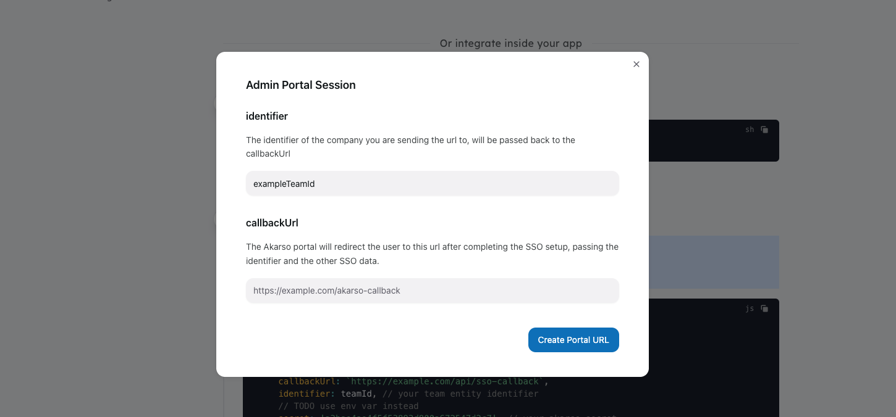

<script setup>

import redirectJsCode from 'website/src/snippets/redirect.raw.js?raw'

import callbackJsCode from 'website/src/snippets/callback.raw.js?raw'

import loginCode from 'website/src/snippets/login.raw.js?raw'
import { useData } from 'vitepress'

</script>

# Sending an Admin Portal URL without writing code

You can generate an Admin Portal URL without writing code, using the [Akarso Dashboard](https://akarso.co).

## Generate the URL

Go to the [Akarso Dashboard](https://akarso.co), and click on the "Create a new Admin Portal URL" button.

Add the `identifier` and `callbackUrl` parameters, and click on "Create".

You can send this URL to the user to let them connect SSO to your app.



## Connect the SSO provider to your team entity

It is recommended to connect the SSO provider to your team entity during the `callbackUrl` redirect:

```js-vue
{{ callbackJsCode }}
```
